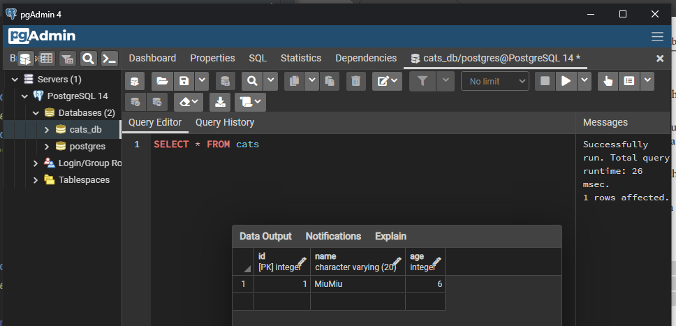
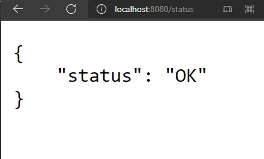
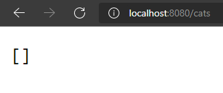
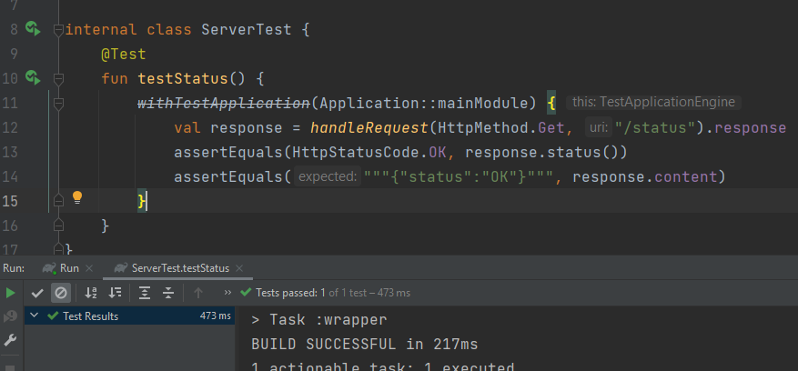
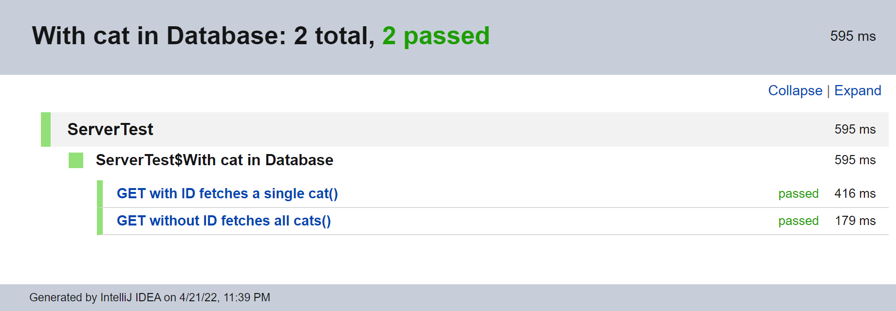

<strong><em>Thanks for your reading, please give me a STAR!<em><strong>
# Concurrent Microservices with Ktor
#### “Building a microservice using the Ktor framework,  and want this microservice to be reactive and to be as close to real life as possible.”
<small><i>(Alexey Soshin)</i></small> 
#### <strong><i>The "CatsHostel" microservice should be able to</i></strong>:
- Supply an endpoint we can ping to check whether the service is up & running;
- List the cats currently in the shelter;
- Provide us with a means to add new cats;
- Making the test consistent;
- Fetching entities;
- Organizing routes in Ktor;
- Achieving concurrency in Ktor.
___
 

 

### Used  Software Info:
- Kotlin v1.6.21 
- IntelliJ IDEA 2021.3.3 or above 
- OpenJDK 11 or above.
- PostgreSQL 14.2

## References:
- https://ktor.io/docs/serialization.html
- Chapter 10 - Kotlin Design Patterns and Best Practices (2e)
###### https://www.packtpub.com/product/kotlin-design-patterns-and-best-practices-second-edition/9781801815727
